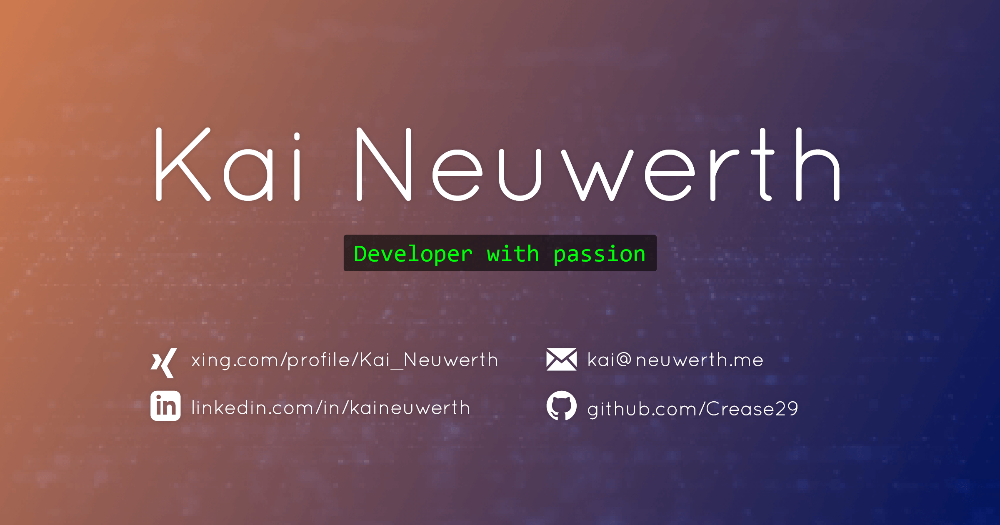

<p align="center">

  

</p>

# :art: My personal website: kai.neuwerth.me

This repository holds my own static website. 
You can see the production state [right here](https://kai.neuwerth.me/).

I'm sorry, that I can't ship the background video that is running there because of the license, 
but I'm sure you will pick your own background video anyways. :blush: Just place it in the `assets/webm/` directory 
and link it in the `index.html`.

## Set up for development

```bash
git clone git@github.com:Crease29/kai.neuwerth.me.git
cd kai.neuwerth.me
npm install
grunt
```

## Feel free to use this codebase

I'd be happy if you just like this setup and "theme" and use it for your own website.
Feel free to leave an issue if you have problems or just want to share what you have done out of it. :blush: :v:
